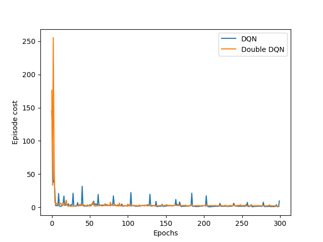

# *Deep Q-learning Network & Double Deep Q-learning Network*

*Reinforcement Learning Assignment 4*

*薛春宇 518021910698*

----------


## 1 *Introduction*

​		在之前所有的 *action value* 的评估方法中，都是将一对状态和行为的值存储在表中。但当任务复杂度较大时，状态空间的大小快速增长，直接保存在表格中的方法将不再可行。因此，需要使用拟合和的值函数进行预测。深度神经网络具有自动提取复杂特征、适用于拟合复杂函数。因此，通过深度神经网络在理论上能够很好地拟合高维状态空间下的值。

​		然而，由于强化学习策略不够稳定，每次神经网络更新时往往会伴随策略的改变，直接将 *DNN* 应用于值函数的拟合可能会导致不收敛。在此背景下，**深度Q网络 (*Deep Q-network, DQN*)** [1] 使用了**固定目标网络 (*Fixed Target Network*)** 和**经验重放 (*Experience Replay*) ** 两项方案对原始的 *DNN* 进行改进：

- 在固定目标网络策略中，*DQN* 分别使用 *Q* 网络来评估、拟合值函数，使用目标网络 *Q'* 来决定操作。*Q* 网络在每一步中都会更新，而 *Q'* 则会在特定步数之后被更新为当前的 *Q*，即在该步数内均保持 *fixed* 状态，保证了算法的稳定性。
- 在经验重放策略中，*DQN* 会设置一个 *buffer* 来存储之前策略 $\pi$ 下的 *action* 与环境交互的 *episode*，并在每次迭代中随机采样一个 *batch* 的样本，而不是简单重复最近的 *episode*。样本 $(s_t, a_t, a_t, s_{t+1})$ 将被用于 *DNN* 的训练。

​        然而，*DQN* 仍无法克服 *Q-learning* 的固有缺陷：**过估计 *Over-estimation***。过估计是指估计的值函数比真实值函数要大，*Q-learning* 之所以存在过估计的问题，就在于其中的最大化操作。*max* 操作使得估计的值函数比值函数的真实值大。如果值函数每一点的值都被过估计了相同的幅度，即过估计量是均匀的，那么由于最优策略是贪婪策略，即找到最大的值函数所对应的动作，这时候最优策略是保持不变的。也就是说，在这种情况下，即使值函数被过估计了，也不影响最优的策略。强化学习的目标是找到最优的策略，而不是要得到值函数，所以这时候就算是值函数被过估计了，最终也不影响我们解决问题。然而，在实际情况中，过估计量并非是均匀的，因此值函数的过估计会影响最终的策略决策，从而导致最终的策略并非最优，而只是次优。[2]

​		为解决上述过估计的问题，在 *DQN* 之外， ***Double Deep Q-network* 的改进算法**被提出，本项目也将基于已有成果实现 *DDQN* 算法，并对 *DQN* 和 *DDQN* 在经典强化学习环境 *MountainCar-v0* 上的性能进行评估和对比。

-----


## 2 环境配置：*MountainCar-v0*

​		MountainCar-v0* 问题由 [3] 提出。如图 *1* 所示。

<center>  <br> <div style="color:white; border-bottom: 2px solid white; display: inline-block; color: black; padding: 2px; zoom: 100%">图 1:Mountain Car Environment</div> </center>

​		二维平面上的峡谷中，一辆小车沿峡谷的一维曲线行驶，问题的目标是驶上右侧较高的山峰；然而，由于重力的作用要强于汽车引擎，汽车无法在陡坡上加速，仅能在山谷底部踩油门。因此，*agent* 必须学习如何利用势能的积累，使其达到右侧山坡上的终点。本次实验中，我们使用 *gym* 来模拟该环境，一个简单的环境配置如下所示：

```python
import gym
env = gym.make('MountainCar-v0')
env.reset()
for _ in range(1000):
    env.render()
    env.step(env.action_space.sample()) # take a random action
env.close()
```

------


## 3 实验内容

### 3.1 问题描述

​		*MountainCar-v0* 问题中，小车的状态空间是一个二维的连续状态空间 *(Velocity, Position)*，状态空间 *Action* 是包含 *{-1, 0, 1}*，其中 *-1* 表示向左行驶，*0* 表示相对静止，*1* 表示向右行驶。需要注意的是，这里的 *Position* 表示小车在屏幕空间中的高度，因此终点被设置为当 *Position* 大于等于 *Flag Position* 时到达。各个变量的取值如下：

&nbsp; &nbsp;  &nbsp;  &nbsp;   &nbsp;  &nbsp;  &nbsp;  &nbsp;  $Velocity \ \in \ (-0.07, \ 0.07), \ Position \ \in (-1.2, 0.6), \ Action \ \in \{-1, 0, 1\}$


### 3.2 *DQN* 算法

​		*DQN* 算法解决了状态空间连续或离散点过大时造成的额外花费问题，由 [1] 在 *2015* 年提出，是一种将 *Q-learning* 算法与深度神经网络 *DNN* 结合起来的方法。*DQN* 算法伪代码如下所示：


​		与传统 *Q-learning* 算法中使用 *Q* 表进行状态更新不同的是， *DQN* 将行为和状态作为输入，在神经网络中进行相应 *Q* 的预测，并通过固定目标网络和经验重放两个方法，根据交互数据不断更新网络参数，以逐步逼近最佳策略。

### 3.3 *Double DQN* 算法

​		在 *DDQN* 之前，基本上所有的目标 *Q* 值都是通过贪婪法直接得到的，无论是 *Q-learning*， *DQN* 还是 *Nature DQN*，都是如此。比如对于 *Nature DQN*，虽然用了两个 *Q* 网络并使用目标 *Q* 网络计算 *Q* 值，其第 *j* 个样本的目标 *Q* 值的计算还是贪婪法得到的 [4]。使用 *max* 虽然可以快速让 *Q* 值向可能的优化目标靠拢，但是很容易过犹不及，导致**过估计 *(Over Estimation)***，所谓过度估计就是最终我们得到的算法模型有很大的偏差。为了解决这个问题， *DDQN* 通过解耦目标 *Q* 值动作的选择和目标 *Q* 值的计算这两步，来达到消除过度估计的问题。*DDQN* 的伪代码如下：


​		*DDQN* 的算法与 *DQN* 基本一致，仅仅是目标网络的行为选择有所不同。

### 3.4 网络结构及参数设置

​		在 *DQN* 和 *DDQN* 所实现的神经网络中，由于状态被抽象为汽车的 *position* 和 *velociity*，特征维度较低，因此不需要使用卷积层来实现隐层，而是采用了两个全连接层的简单设计，每个全连接层设置了 *16* 个神经元。该网络的输入是 *(position, velocity)* 的二维特征向量，输出是 $action \in \{-1, 0, 1\}$。为了更全面地学习特征，模型的学习率被设置为 *0.0001*，$\varepsilon$ *- greedy* 中设置 $\varepsilon = 0.9$，且从 *0* 开始逐代以 *0.0001* 的速率增长。*DQN / DDQN* 中经验重放策略所对应的 *buffer size* 被设置为 *4096*， 单次采样的 *batch size* 为 *64*。最后，每经过 *replace_target_iter = 300* 轮迭代后使用最新的 *Q* 网络的参数对目标网络进行一次更新。整个模型训练共持续 *300* 个 *epoch*。

### 3.5 代码格式

​		本项目的实现分为以下两个部分：

- *RL_brain.py*：该文件实现了两个类，分别是 *Class DeepQNetwork* 和 *Class Double_DeepQNetwork*，并设置了相应的类参数接口，供以个性化设置网络。
- *MountainCar-v0.py*：该文件分别依次调用了上述两个类，进行模型的训练，最终输出 *DQN* 和 *DDQN* 在性能上的比较结果。此外，我们会将 *DQN* 和 *DDQN* 在运行过程中的 *log* 信息写入到 *./output* 目录下，以供后续的调试。

-----


## 4 实验结果

​		在 *300* 个 *epoch* 的训练后，*DQN* 和 *DDQN* 算法下的小车均能够在短时间内到达位于右侧山顶上的终点，但根据统计结果来看，二者在性能上仍存在一定的差异。

    

​		上图所表示的统计量从左到右分别为：*# of steps in episode*、*episode cost* 和 *episode time*，均可得出结论：***Double DQN* 达到近似收敛的速度慢于 *DQN* ，但收敛后的稳定性要明显强于 *DQN* **。考虑到模型的稳定性仍旧是性能评估的一项重要指标，且二者在收敛速度上的差异并不大，***Double DQN* 在 *MountainCar-v0* 问题上的性能表现要显著优于 *DQN***。

​		此外，我们也分别对 *DQN* 和 *Double DQN* 随 *training steps* 变化的 *cost* 进行了统计。

  

​		上图依次为 *DQN* 和 *Double DQN* 随 *training steps* 变化的 *cost* 统计，可以发现，两个模型的 *cost* 并没有如预想中的那样平滑下降，而是在较大范围内波动。分析其原因，可能是由于在不同的状态中，观测数据会发生变化，这会在经验重放的策略下影响 *DQN* 和 *DDQN* 的输入，从而导致 *cost* 的波动。*cost* 规律性的突然增大可能是由每 *replace_target_iter* 次迭代目标网络的更新造成的。

-----


## 5 实验心得

​		在本次实验的过程中，我首先在课堂授课内容的基础上，系统性地学习了 *DQN* 算法和 *Double DQN* 算法的相关知识，并掌握了其在代码层面上的实现方法。在实现的过程中，由于 从伪代码到 *python* 代码的差别还是比较大的，我遇到了一些困难，其中就包括了在网络设计的过程中，网络结构和超参数的调试由于缺乏理论依据，只能依靠手动调试后人工比对效果。

​		整个过程约花费一天半的时间，在本次实验中，我不仅了解了两种控制方案的基本知识，掌握了从伪代码到可运行代码的复现方法，更是提高了自身发现 *bug*，解决 *bug* 的能力。希望在接下来的实验中也能收获满满!


## *References*

[1] V. Mnih, K. Kavukcuoglu, D. Silver, A. A. Rusu, J. Veness, M. G. Bellemare, A. Graves, M. Riedmiller, A. K. Fidjeland, G. Ostrovski, S. Petersen, C. Beattie, A. Sadik, I. Antonoglou, H. King, D. Kumaran, D. Wierstra, S. Legg, and D. Hassabis, “Human-level control through deep reinforcement learning,” Nature, vol. 518, no. 7540, pp. 529–533, Feb. 2015. [Online]. Available: http://dx.doi.org/10.1038/nature14236

[2] 《强化学习：DQN与Double DQN讨论》: http://www.broadview.com.cn/article/419382

[3] A. W. Moore, “Efficient memory-based learning for robot control,” Tech. Rep., 1990.

[4] 强化学习（十）Double DQN (DDQN)》: https://www.cnblogs.com/pinard/p/9778063.html