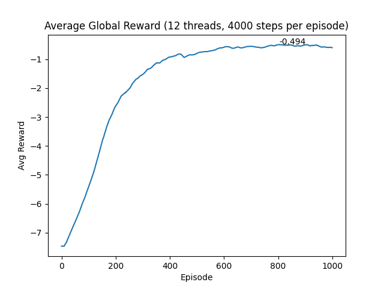
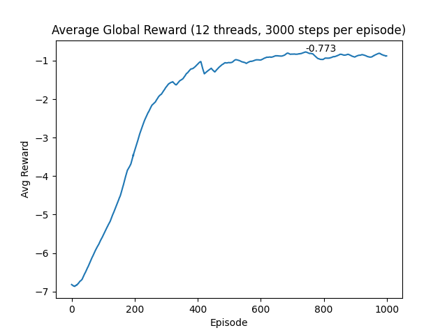
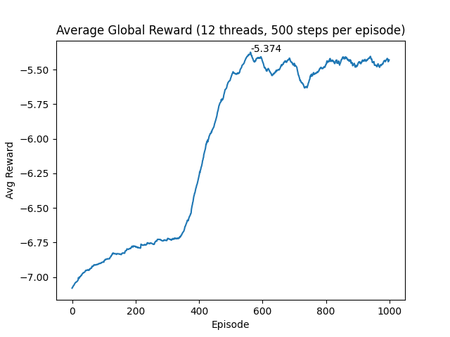
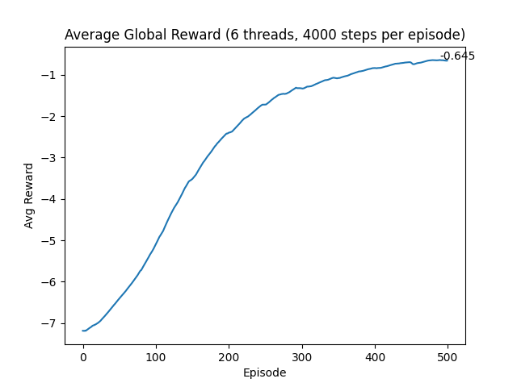
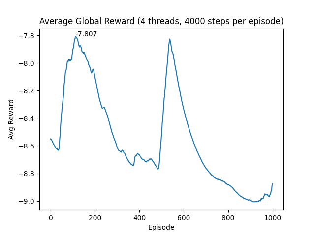

# *Asynchronous Advantage Actor-critic (A3C) Algorithm*

*Reinforcement Learning Assignment 5*

*薛春宇 518021910698*

----------


## 1 *Introduction*

​		在解决未处理、高维输入的复杂任务上，深度 *Q* 网络 (*DQN* *[1]*) 等算法已经取得了良好的性能。然而，*DQN* 由于需要找到能够最大化 *Q* 的离散动作，因此仅能解决离散和位于低维动作空间的问题。在 *policy gradient* 的连续性性质下，*Actor-Critic* 算法可被用于解决具有连续和高维动作空间的问题。本文中，我们将介绍基于 *AC* 算法的改进算法：***Asynchronous Advantage Actor-critic (A3C)* 算法**，并在 *Pendulum-v0* 的 *gym* 环境中进行实验和性能分析。

---------

### 1.1 *Actor-critic (AC) Algorithm*

​		*Actor-Critic* 从名字上看包括两部分，演员 (*Actor*) 和评价者 (*Critic*)。其中 ***Actor* 使用策略函数，负责生成动作 (*Action*) 并和环境交互**。而 ***Critic* 使用价值函数，负责评估 *Actor* 的表现，并指导Actor下一阶段的动作**。在 *Actor-Critic* 算法中，我们需要做两组近似，这也已经在 *Policy-based Reinforcement Learning* 中提到：

- 第一组是策略函数的近似：

    ​																	$\pi_{\theta}(s, a) \ = \ P(a|s, \theta) \ \approx \ \pi(a|s)$

- 第二组时价值函数的近似，对于状态价值和动作价值函数分别是：

    ​																			$\hat v(s, w) \ \approx \ v_\pi(s)$

    ​																		$\hat q(s, a, w) \ \approx \ q_\pi(s, a)$

​		在之前学过的 *Monte-Carlo Policy Gradient (REINFORCE)* 算法中，我们通过随机梯度上升 *Stochastic Gradient Ascent* 的方法来更新网络参数，参考策略梯度定理，并使用返回值 $v_t$ 来作为 $Q^{\pi_\theta}(s_t, a_t)$ 的 *unbiased sample*，得出策略的参数更新公式为：

​																			$\Delta \theta \ = \ \alpha \nabla_\theta \log \pi_\theta(s_t, a_t)v_t$

​		在 *AC* 系统中的 *Actor* 里，需要使用上述策略更新的公式，来不断更新参数，生成最优动作。但与 *Monte-Carlo Policy Gradient (REINFORCE)* 不同的是，公式中的 $v_t$ 不再来自于蒙特卡罗采样，而应该从 *AC* 系统中的另一个组成部分 —— *Critic* 那里得到。对于 *Critic*，我们参考 *DQN* 的做法，使用一个 *Q* 网络来进行表示，其输入可以为状态，输出则为最优动作的价值或全部动作各自的价值。

​		因此，***AC* 算法的主要框架**为：

​		*(1)*  *Critic* 通过 *Q* 网络计算当前状态的最优价值 $v_t$，返回给 *Actor*；从 *Actor* 得到反馈和新的状态后，更新 *Q* 网络

​		*(2)*  *Actor* 利用 $v_t$ 迭代更新策略函数的参数 $\theta$，并以此选择动作，得到反馈和新的状态，返回给 *Critic*

------------

### 1.2 *Asynchronous Advantage Actor-critic (A3C) Algorithm*

​		在 *AC* 算法的使用过程中，虽然可以进行单步更新，相较于传统 *Policy Gradient* 算法的回合更新要快，但算法本身难以收敛，原因是 *Actor* 的行为取决于 *Critic* 的 *Value*，由于 *Critic* 本身就很难收敛，*Actor* 一起更新则会更难收敛。

​		针对上述问题，参考 *DQN* 算法的实现，我们可以使用经验回放来解决难以收敛的问题。然而，经验回放本身也有问题，回放池内的经验数据相关性太强，用于训练的时候效果很可能不佳。

​		*A3C* 算法 *[2]* 基于经验回放的思想，使用多线程同时与环境交互学习的方法，解决了经验回放数据相关性的问题。在多线程中，每个线程都将自身与环境交互学习到的成功汇总起来，整理并保存在一个公共的地方，并定期把大家齐心学习的成果拿出来，指导自己和环境后面的学习交互，以达到**异步并行**的目的。*A3C* 算法的网络结构如下图所示，在 *3.1* 节中，我们将对 *A3C* 算法做更进一步的介绍。


-----


## 2 环境配置：*Pendulum-v0*

​		*Pendulum-v0* 问题 *[3]* 的场景中，存在一个无摩擦、可垂直摆动的摆锤，如下左图所示。问题的目标是训练 *agent* 使得该摆锤能够尽量指向正上方，并保持平衡。摆锤每次都从一个随机的位置开始，由于该场景属于 *unsolved environment*，因此并没有奖励阈值，也没有形如 “到达某点即可结束” 明确的终止条件。*Pendulum-v0* 问题的场景下有三个观测输入：摆角的正弦值 $\sin(\theta)$、余弦值 $\cos(\theta)$ 和角速度 $\theta_{dt}$，三个输入的取值范围如下右图所示：

​					          

​		三个输入的联合左右效果的取值范围为 $[-2, \ 2]$，且 *reward* 的估计函数如下：

​														$R \ = \ -(\theta^2 \ + \ 0.1 \times \theta^2_{dt} \ + \ 0.001 \times action^2)$

​		其中，$\theta$ 的取值范围为 $[-\pi, \ \pi]$，$\theta_{dt}$ 代表摆锤的角速度。本次实验中，我们使用 *gym* 来模拟该环境，一个简单的环境配置如下所示：

```python
import gym
env = gym.make('Pendulum-v0')
env.reset()
for _ in range(1000):
    env.render()
    env.step(env.action_space.sample()) # take a random action
env.close()
```

​		此外，实验环境的版本信息为：***Python***: 3.6，***Gym***: 0.18.0，***Pyglet***: 1.5.11，***Pytorch***: 1.3.1

---------


## 3 实验内容

### 3.1 *A3C* 算法

​		*A3C* 算法最早由 *DeepMind* 提出 *[2]*，用以解决 *Actor-Critic* 算法难以收敛的问题。*A3C* 算法利用计算机并行计算的能力，创建多个并行环境，让多个具有相同 *AC* 网络结构 (*local network*) 的 *worker* 分别在这些环境中进行独立交互、经验存储，并同时对 *Global AC Network* 进行周期性的参数更新。在参数更新的同时，各个 *worker* 也会用 *global network* 的网络参数更新自身 *local network*，进而在保证迭代学习的基础上，减少参数更新的相关性，进而提高了整个算法的收敛性。*A3C* 算法的伪代码如下：


​		相较于传统的 *AC* ，*A3C* 算法主要有以下三点改进：

- **异步训练框架**：

    前图中上面的 ***Global Network*** 就是 *1.2* 节说的共享的公共部分，主要是一个公共的神经网络模型，这个神经网络**包括 *Actor* 网络和*Critic* 网络两部分的功能**。下面有 ***n* 个 *worker* 线程**，**每个线程里有和公共的神经网络一样的网络结构**，每个线程会独立的和环境进行交互得到经验数据，这些线程之间**互不干扰，独立运行**。

    每个线程和环境交互到一定量的数据后，就计算在自己线程里的神经网络损失函数的梯度，但是这些梯度却并不更新自己线程里的神经网络，而是去更新公共的神经网络。也就是 ***n* 个线程会独立的使用累积的梯度分别更新公共部分的神经网络模型参数**。**每隔一段时间，线程会将自己的神经网络的参数更新为公共神经网络的参数，进而指导后面的环境交互**。

    可见，公共部分的网络模型就是我们要学习的模型，而线程里的网络模型主要是用于和环境交互使用的，这些线程里的模型可以帮助线程更好的和环境交互，拿到高质量的数据帮助模型更快收敛。

- **网络结构优化**：

    与 *AC* 算法不同的是，这里我们将 *Actor* 和 *Critic* 网络在逻辑上合并，即输入状态，输出状态价值 $v_t$ 和对应的策略 $\pi$，当然，二值在物理上仍是两个独立的网络，分别处理：

    

- ***Critic* 评估点的优化**：

    在 *AC* 算法中，我们讨论了使用单步采样来近似估计 $Q(S, A)$，即：$Q(S, A) = R + \gamma V(S')$，其中 $V(S)$ 的值需要通过 *Critic* 网络学习得到。因此优势函数可以表达为：

    ​																	$A(S, t) \ = \ R + \gamma V(S') - V(S)$

    在 *A3C* 算法中，**使用 *N* 步采样以加快收敛**，因此优势函数可以表示为：

    ​												$A(S, t) \ = \ R_t + \gamma R_{t+1} + ... + \gamma^{n-1}R_{t+n-1} + \gamma^n V(S') - V(S)$

    对于 *Actor* 和 *Critic* 的损失函数部分，和 *AC* 基本相同。有一个小的优化点就是在 *Actor-Critic* 策略函数的损失函数中，加入了策略 $\pi$ 的熵项，系数为 *c*，即策略参数的梯度更新变成如下形式：

    ​														$\Delta \theta \ = \ \alpha \nabla_\theta \log \pi_\theta(s_t, a_t)A(S, t) + c \nabla_\theta H(\pi(S_t, \theta))$

-----

### 3.2  代码结构

​		本项目的实现分为以下三个部分：

- *RL_brain.py*：该文件实现了三个类，分别是 *Class AC_Network*，*Class Worker* 和 *Class Shared_Adam*：
    - *AC_Network* 类主要搭建了 *AC* 网络的基本架构，包括网络设计、前向传播、*Actor* 的动作选择和损失函数的计算：
    
        - `__init__()`：声明类变量
        - `forward()`：网络的前向传播
        - `choose_action()`：由 *AC network* 内的 *Actor* 根据状态生成动作的概率分布，以供采样
        - `loss_function()`：计算实际状态值和目标状态值之间的 *TD error*，进而计算 *Critic loss* 和 *Actor loss*，并求出网络的 *loss*，具体实现参照了 *A3C* 算法的伪代码，以及上述针对网络评估优化点的分析：
    
        ```python
        def loss_function(self, state, action, state_value_target):
        		# Model training
        		self.train()
        		# Network forward
        		mu, sigma, state_value = self.forward(state)
        		# TD error
        		td_error = state_value_target - state_value
        		
        		# Critic's loss
        		critic_loss = td_error.pow(2)
        
        		# Normal distribution
        		distribution = self.distribution(mu, sigma)
        		# Log probability
        		log_prob = distribution.log_prob(action)
        		entropy = distribution.entropy()
        		exp_v = log_prob * td_error.detach() + self._beta * entropy
        		# Actor's loss
        		actor_loss = -exp_v
        
        		# Total loss: mean of actor loss and critic loss
        		total_loss = (actor_loss + critic_loss).mean()
        		return total_loss
        ```
    
    - *Worker* 类为每个 *worker thread* 创建了一个独立的 *Pendulum-v0* 环境，调用 *AC_Network* 类搭建了一个 *local network*，并通过 *run* 函数实现了每个 *worker* 与环境的单独交互、样本存储、对 *global network* 的更新以及抓取参数以更新 *local network*：
    
        - `__init__()`：声明类变量
    
        - `run()`：模型运行的主要函数，包含对 *episode* 的遍历，与环境的交互及经验的存储，结果的记录以及调用 `push_and_pull()` 进行 *global network* 的更新和 *local network* 的参数更新。
    
            ```python
            # Update global network, and assign to local network
            if total_step % self.update_global_network_iter == 0 or is_done:
            		# Sync
            		push_and_pull(self.optimizer, self.local_network, self.global_network, is_done, next_state,
                                              state_buffer, action_buffer, reward_buffer, self._gamma)
            		# Clear buffer
            		state_buffer, action_buffer, reward_buffer = [], [], []
            ```
    
    - *Shared_Adam* 类主要实现了一个可以全局共享的 *Adam* 优化器，以便于整个网络的训练
    
- *Pendulum-v0.py*：该文件分别从 *RL_brain.py* 中依次调用 *AC_Network* 和 *Worker* 类，搭建 *A3C* 网络架构，进行模型的多线程训练，并调用 *Shared_Adam* 类进行全局优化器的声明。此外，我们会保存模型，将每个 *episode* 的平均到每个 *step* 的 *average reward* 记录到列表内，并绘制相应的统计折线图，以供后续的结果分析，部分源码见下：

```python
if __name__ == "__main__":
    # Create AC global network
    AC_global_network = AC_Network(N_S, N_A, _beta)

    # Share the global parameters in multiprocessing
    AC_global_network.share_memory()
    # Global optimizer
    global_optimizer = Shared_Adam(AC_global_network.parameters(), lr=1e-4, betas=(0.96, 0.999))
    # Global episodes
    global_episodes = Value('i', 0)
    # Global episode rewards
    global_episode_rewards = Value('d', 0.)
    # Res queue for episode rewards
    res_queue = Queue()

    # Create worker threads
    workers = [Worker(N_S, N_A, _gamma, _beta, GAME, AC_global_network, global_optimizer, global_episodes,
                      global_episode_rewards, res_queue, i, MAX_EP, MAX_EP_STEP,
                      update_global_network_iter) for i in range(workers_num)]
    # Start workers
    [worker.start() for worker in workers]
```

- *utils.py*：该文件实现了一些工具函数，包括数据封装、初始化、*worker* 线程的 *push* 和 *pull* 操作，以及每一个 *episode* 训练结果的 *record*，供其他工程文件调用：

    - `v_wrap()`：对 *numpy* 进行封装
    - `set_init()`：网络 *layers* 的参数初始化
    - `push_and_pull()`：由 *worker thread* 调用，通过后向传播更新 *global network*，并利用其参数更新 *local network*

    ```python
    loss = local_network.loss_function(
            v_wrap(np.vstack(state_buffer)),
            v_wrap(np.array(action_buffer), dtype=np.int64) if action_buffer[0].dtype == np.int64 else v_wrap(np.vstack(action_buffer)),
            v_wrap(np.array(buffer_v_target)[:, None]))
    
    # Calculate local gradients and push local parameters to global
    optimizer.zero_grad()
    loss.backward()
    for local_params, global_params in zip(local_network.parameters(), global_network.parameters()):
    		global_params._grad = local_params.grad
    optimizer.step()
    
    # Pull global parameters from global network
    local_network.load_state_dict(global_network.state_dict())
    ```

    - `record()`：设置多线程全局变量的锁，更新 *global episodes*，记录本次 *episode* 的平均 *reward*，打印相关训练信息，并利用公式更新 *global rewards*

    ```python
    # Update global reward with variable lock
    with global_rewards.get_lock():
    		if global_rewards.value == 0.:
    				# Global rewards is 0
    				global_rewards.value = episode_reward
    		else:
    				# In case that the reward curve could converge
    				global_rewards.value = global_rewards.value * 0.99 + episode_reward * 0.01
    ```

------------

### 3.3 *AC* 的网络结构及参数设置

​		在 *A3C* 算法所实现的神经网络中，由于 *Pendulum-v0* 环境中状态被抽象为摆锤的 $\sin(\theta)$、$\cos(\theta)$ 和角速度 $\theta_{dt}$，特征维度较低，因此不需要使用卷积层来实现隐层，而是采用数个全连接层的简单设计，分别实现 *Actor* 的动作选取网络，以及 *Critic* 的状态值计算网络。

-  *Actor network*：每个全连接层分别设置了 *200* 个神经元，该子网络的输入是状态 *state*，输出是一个表征当前状态下 *Actor* 预测的动作值分布 (*mu, sigma*)，在后续的 *choose action* 函数中，会根据这两个统计量，构造正态分布，并从中采样出 *action*。采用这样的方式进行动作选取的目的是为了更好地适应 *Pendulum-v0* 环境中的动作连续性。经过测试，全连接层的激活函数被设置为 *relu6*、*tanh* 和 *softplus*，注意到为了使正态分布的方差大于 *0*，我们在计算 *sigma* 时需要加上一个 *bias = 1e-4*。
- *Critic network*：每个全连接层分别设置了 *100* 个神经元，该子网络的输入时状态 *state*，输出是 *Critic* 评估的该状态的状态值。全连接层的激活函数设置为 *relu6*。

```python
# ---------------- Layers ---------------- #
self.actor_layer = Linear(N_S, 200)
self.mu_layer = Linear(200, N_A)
self.sigma_layer = Linear(200, N_A)
self.critic_layer = Linear(N_S, 100)
self.state_value_layer = Linear(100, 1)

# ...

def forward(self, state):
		# Actor network structure
		actor_layer = relu6(self.actor_layer(state))
		mu = tanh(self.mu_layer(actor_layer))
		sigma = softplus(self.sigma_layer(actor_layer)) + 1e-4
		# Critic network structure
 		critic_layer = relu6(self.critic_layer(state))
		state_value = self.state_value_layer(critic_layer)
		return mu, sigma, state_value
```


- *Adam optimizer*：全局优化器的学习率设置为 *1e-4*；*betas* 被设置为 *(0.96, 0.999)*；*eps* 默认为 *1e-8*，其作用是提高数值的稳定性；*weight decay* 被设置为 *0*。

```python
# Global optimizer
global_optimizer = Shared_Adam(AC_global_network.parameters(), lr=1e-4, betas=(0.96, 0.999))
```

- 整个模型设置 *discount factor* 为 *0.9*，*entropy factor* 为 *0.005*，每隔 *10* 轮更新一次 *global network*，默认的最大步数为 *4000*，共 *episode* 数目为 *1000*，默认的线程数为 *12*。注意，后续第 *4* 节的结果分析中会对 *MAX_EP_STEP* 和线程数对训练结果的影响做对比实验，以对实验效果的影响因素进行较为全面的讨论。

```python
# Num of workers
workers_num = cpu_count()
# Iter for updating AC global network
update_global_network_iter = 10
# Discount factor
_gamma = 0.9
# Entropy factor
_beta = 0.005
# Total number of episodes
MAX_EP = 1000
# Total steps per episode
MAX_EP_STEP = 4000
```

-----


## 4 结果分析

​		在本节中，我们使用控制变量的方法，分别研究单个 *episode* 内最大步数 *MAX_EP_STEP* 和 *worker* 线程数对模型收敛结果的影响。

### 4.1 *Episode* 内最大步数 *MAX_EP_STEP*

​		我们分别设计 *3* 组实验，以探究 *MAX_EP_STEP* 对模型收敛速度和效果的影响：

- *Group 1*：总 *worker* 线程数 *12*，*MAX_EP* 为 *1000*，*MAX_EP_STEP* 为 *4000*

- *Group 2*：总 *worker* 线程数 *12*，*MAX_EP* 为 *1000*，*MAX_EP_STEP* 为 *3000*

- *Group 3*：总 *worker* 线程数 *12*，*MAX_EP* 为 *1000*，*MAX_EP_STEP* 为 *500*

    三组实验的 *average global reward* 统计图分别见下左、中、右图。

  

​		从 *Group 1* 和 *Group 2* 的结果对比可以看出，当 *MAX_EP_STEP* 取得足够大时，适当降低并不会引起收敛速度的较大降幅；然而，*MAX_EP_STEP* 取得越大，在模型达到或趋近收敛时的稳定性也会越好，上述现象的原因是每个 *worker* 在交互时积累的经验越多，反馈给 *global network* 的信息就会越全面、越稳定，相应地也不容易产生大的波动。

​		当我们进一步缩小 *MAX_EP_STEP* 时，如 *Group 3* 的结果所示，不仅收敛速度显著降低，相同 *episode* 数目内达到了最大 *average step reward* 也显著下降，且模型波动很大，收敛效果很差。

​		综上所述，我们可以得到如下结论：

- 当 *MAX_EP_STEP* 较小时，增大单个 *episode* 内最大步数可以显著提高模型的收敛速度和收敛效果；
- 当 *MAX_EP_STEP* 较大时，增大单个 *episode* 内最大步数可以部分提高模型的收敛效果，但对收敛速度提升不大。

------

### 4.2 *Worker* 线程数

​		我们分别设计 *3* 组实验，以探究 *worker* 线程数对模型收敛速度和效果的影响：

- *Group 1*：总 *worker* 线程数 *12*，*MAX_EP* 为 *1000*，*MAX_EP_STEP* 为 *4000*

- *Group 2*：总 *worker* 线程数 *6*，*MAX_EP* 为 *500*，*MAX_EP_STEP* 为 *4000*

- *Group 3*：总 *worker* 线程数 *4，*MAX_EP* 为 *1000*，*MAX_EP_STEP* 为 *4000*

    三组实验的 *average global reward* 统计图分别见下左、中、右图。

    

​		在 *Group 1* 和 *Group 2* 中，为了保证总训练时间的基本一致，且由于每个 *worker* 的训练是并行的，因此在讲线程数减半、步数不变的情况下，需要将 *episode* 总数减半。可以看出，当 *worker* 线程数减少时，模型相应的收敛速度和效果也都会下降。

​		在 *Group 1* 和 *Group 3* 中，我们仅改变线程数，同样可以发现模型的收敛效果和收敛速度均发生显著下降。

​		综上所属，我们可以得到如下结论：

- 降低 *worker* 线程数时，模型的收敛速度和收敛效果会显著下降
- 降低 *worker* 线程数时，运行相同 *episode* 所需要的总时间显著上升

-----


## 5 实验心得

​		在本次实验的过程中，我首先在课堂授课内容的基础上，系统性地学习了 *AC* 算法和 *A3C* 算法的相关知识，并掌握了其在代码层面上的实现方法。在实现的过程中，由于 从伪代码到 *python* 代码的差别还是比较大的，我遇到了一些困难，其中就包括了在网络设计的过程中，网络结构和超参数的调试由于缺乏理论依据，只能依靠手动调试后人工比对效果。同时，由于对 *pytorch* 工具的使用不熟悉，我在根据理论知识复现 *loss*、*push_and_pull* 等相关函数时，遇到了 *API* 使不熟练的问题，通过大量查阅相关教程才得以解决。

​		整个过程约花费一天半的时间，在本次实验中，我不仅了解了两种控制方案的基本知识，掌握了从 *A3C* 算法伪代码到可运行代码的复现方法，更是提高了自身发现 *bug*，解决 *bug* 的能力。希望在接下来的实验中也能收获满满!


## *References*

*[1] V. Mnih, K. Kavukcuoglu, D. Silver, A. A. Rusu, J. Veness, M. G. Bellemare, A. Graves, M. A. Riedmiller, A. Fidjeland, G. Ostrovski, S. Petersen, C. Beattie, A. Sadik, I. Antonoglou, H. King, D. Kumaran, D. Wierstra, S. Legg, and D. Hassabis, “Human-level control through deep reinforcement learning,” Nature, vol. 518, no. 7540, pp. 529–533, 2015. [Online]. Available: https://doi.org/10.1038/nature14236*

*[2] Mnih V, Badia A P, Mirza M, et al. Asynchronous methods for deep reinforcement learning[C]//International conference on machine learning. 2016: 1928-1937.*

*[3] https://github.com/openai/gym/wiki/Pendulum-v0*